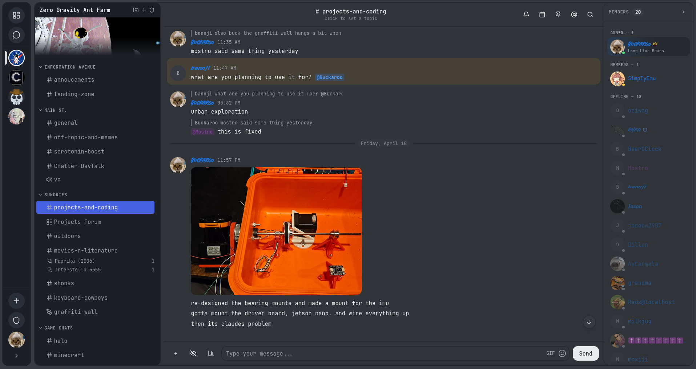

# Chatter

A lightweight, performant, self-hosted chat application built with Rust. Chatter implements real-time messaging, voice chat, and screen sharing. Development is moving fast, features are currently offered as is with no guarantee of functionality. 



---

## Features

- **Rooms**
- **Real-time messaging**
- **Voice chat** 
- **Multi Screen sharing (Requires HTTPS for WebRTC)**
- **File sharing**
- **Code snippets with syntax highlighting**
- **Direct messages** 
- **Custom emojis**
- **Room invite links**

## Prerequisites

- **Rust** (stable toolchain) -- [Install via rustup](https://rustup.rs/)
- **Node.js** (v18 or later) and **npm**

## Quick Start

1. **Clone the repository:**

   ```bash
   git clone https://github.com/Sphyrna-029/Chatter.git
   cd Chatter
   ```

2. **Build the frontend:**

   ```bash
   cd client
   npm install
   npm run build
   cd ..
   ```

3. **Build and run the server:**

   ```bash
   cargo run --release
   ```

4. **Open your browser** at [http://localhost:8000](http://localhost:8000).

Register an account directly from the login screen -- no email required.

## Development

For frontend development with hot reload, run the Vite dev server alongside the backend:

```bash
# Terminal 1 -- start the backend
cargo run

# Terminal 2 -- start the Vite dev server
cd client
npm run dev
```

The dev server runs at `http://localhost:5173` and proxies API requests to the backend on port 8000.

## Project Structure

```
.
├── src/
│   └── main.rs          # Axum server: REST API, WebSocket, WebRTC
├── client/
│   ├── src/
│   │   ├── components/  # React UI components
│   │   ├── lib/
│   │   │   ├── api.ts   # HTTP API client
│   │   │   └── store.tsx # Global state (Context + useReducer)
│   │   └── ...
│   └── ...
├── Cargo.toml
└── README.md
```

The server is a single Rust file (`src/main.rs`) using [Axum](https://github.com/tokio-rs/axum). It serves the Matrix-compatible REST API, handles WebSocket connections for real-time events, and serves the built React frontend as static files from `client/dist/`.

## Deployment

### Standard deployment

Build an optimized release binary and the frontend assets:

```bash
cd client && npm install && npm run build && cd ..
cargo build --release
```

The compiled binary is at `target/release/chatter`. To run it:

```bash
./target/release/chatter
```

The server listens on `0.0.0.0:8000` by default.

### Docker

A multi-stage `Dockerfile` is included in the repository. It builds both the frontend and backend, producing a minimal Debian-based image.

**Build the image:**

```bash
docker build -t chatter .
```

**Run the container:**

```bash
docker run -d -p 8000:8000/tcp -p 8000:8000/udp --name chatter chatter
```

Chatter will be available at [http://localhost:8000](http://localhost:8000).

To run on a different host port (for example, 3000):

```bash
docker run -d -p 3000:8000/tcp -p 3000:8000/udp --name chatter chatter
```

The container includes a health check that polls the server every 30 seconds. You can verify the container is healthy with:

```bash
docker ps
```

**Stop and remove the container:**

```bash
docker stop chatter && docker rm chatter
```

## Notes

- All data is stored in memory. Restarting the server clears all rooms, messages, and accounts.
- HTTPS context is required for WebRTC (screen share, voice)
- There is no built-in TLS. Use a reverse proxy for HTTPS in production.
- Voice chat and screen sharing require a secure context (HTTPS) in most browsers.

## License

See [LICENSE](LICENSE) for details.
